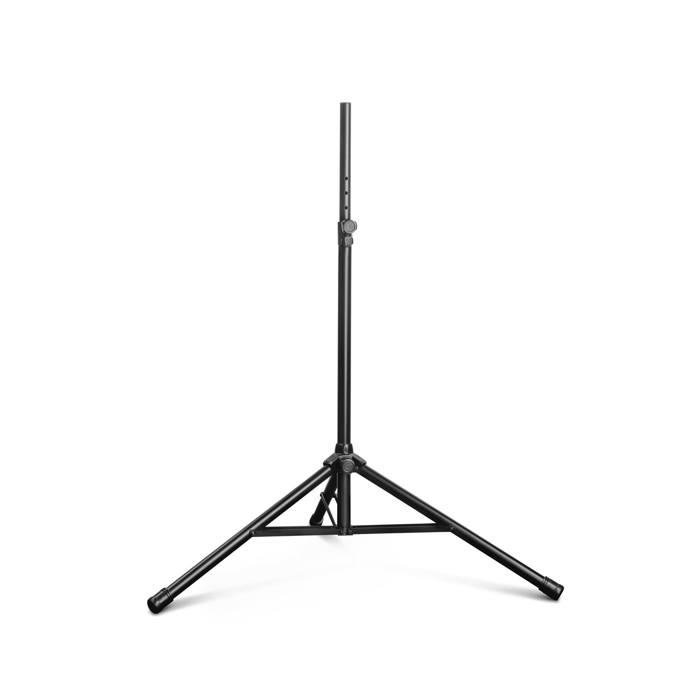
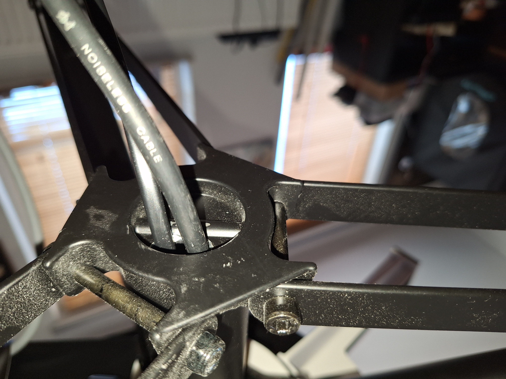
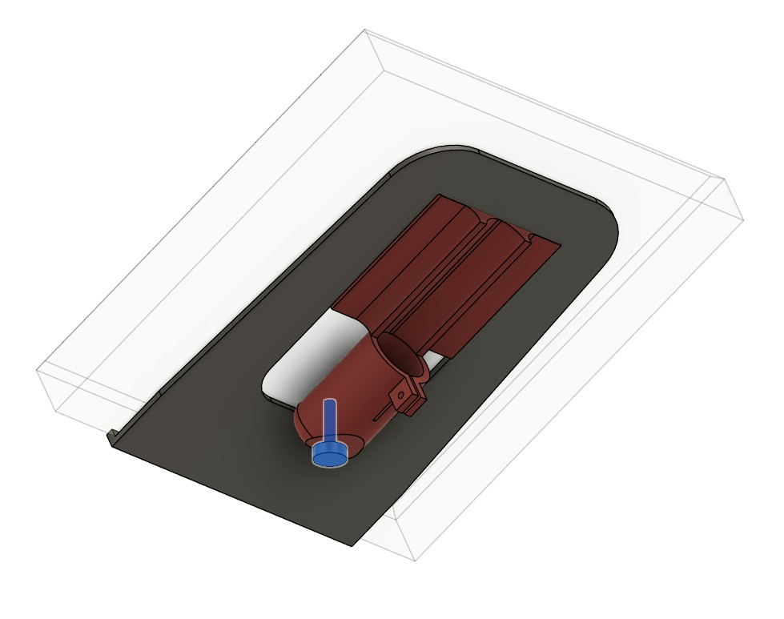
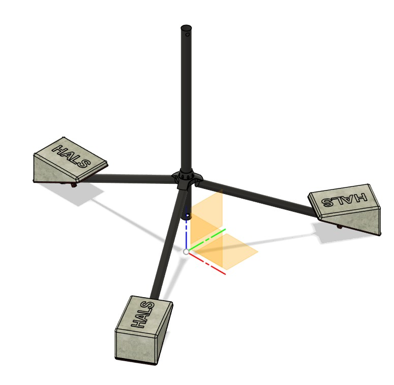

# HALS-Mechatronics: BASE readme
## The BASE 
Foot & Central Pillar function is fulfilled with a Gravity TSP5212B tripod, a very sturdy steel tripod. I only use the base tube of the central axis, its diameter is ~41.3mm and wall thickness of ~1.6mm. 
The extension tube is not used; it is also not very straight. This also allows me to remove the top-clamping mechanism, so to have just the bare central pillar tube.
The pictures GTSP5212LB_2 to _5 give an indication of its construction. 

The aluminium mounting bracket is a crucial element:   
This will hold the rotatingdrive assembly, its details covered in RotatingDrive folder.

## Cabling for the DUT: Speaker, Mains, XLR signal
For the cabling needed for the DUT a hole is drilled in the bottom-bracket, given its design that is limited to ~ 15mm, to not weaken that part too much.
If a passive DUT, a loudspeaker cable is used, and if active a mains voltage cable and a XLR cable is used. For the XLR cable it requires desoldering and re-soldering the XLR plug.

## Stability
Testing has shown that tipping over can occur, so intially I chose to apply concrete tiles of ~7kg at the end of each leg, combined with replacing the rubber endcaps with 3D printed ones which also house level-adjustable screw.

The tiles proved it was ok, so a more functional shape is designed and used as a mould for casting concrete:

The casted concrete weight are now in use, and functions fine.

## 3D models
For the 3D models,  Fusion360 archive files -TripodLeg-Endcaps-WeightBrackets.f3z- are present for the 3D models of the endcap, mass-plateau-glued and weight-bracket (to be glued to the 7kg mass). 
The adjustable M8x24mm foot(screw) is also as simple 3D model present.
The excel holds the decisions I made, and on a separate tab the BOM.
The images give an idea of the 3D models and the used adjustable foot.
For the printable parts the Fusion360 holds the 3D models
For the casted concrete weights a compact 3D model is added, in 2 parts, to be used for casting.

