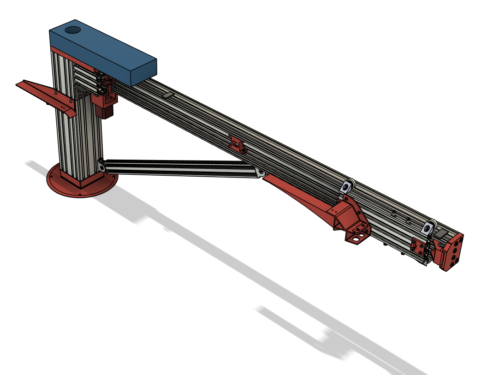
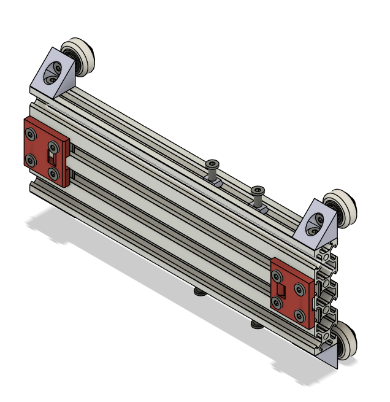
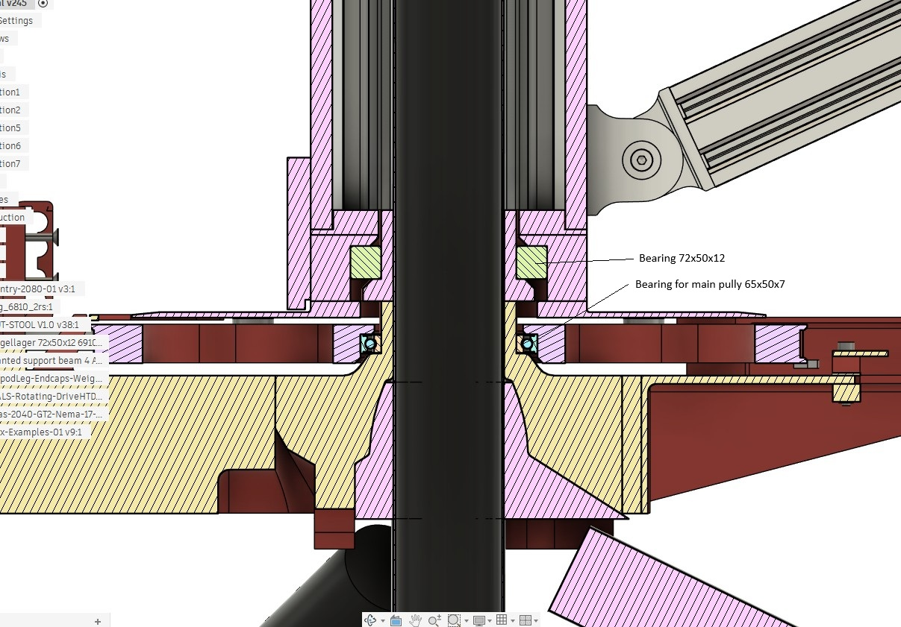
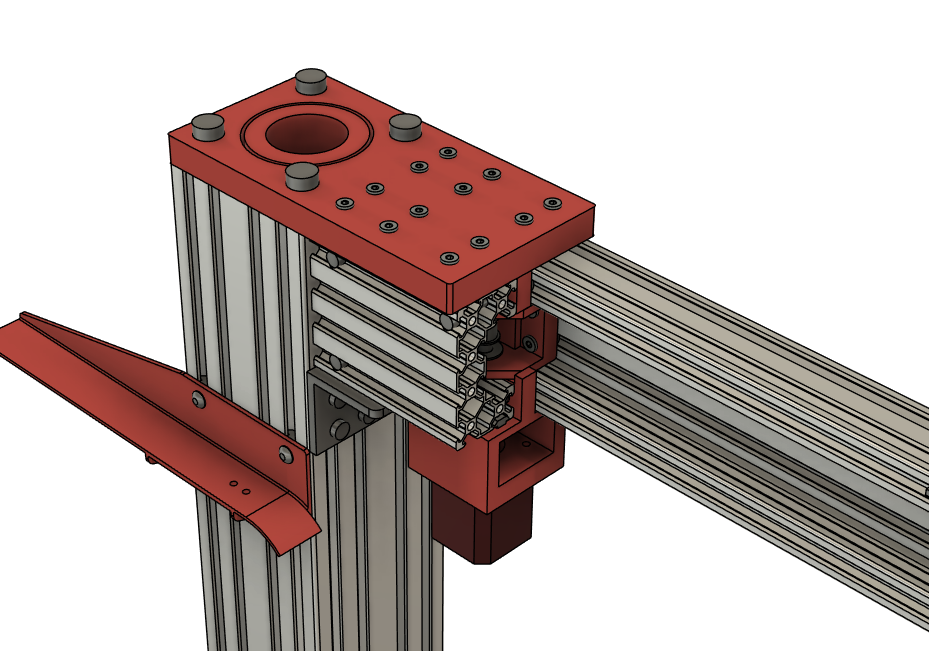
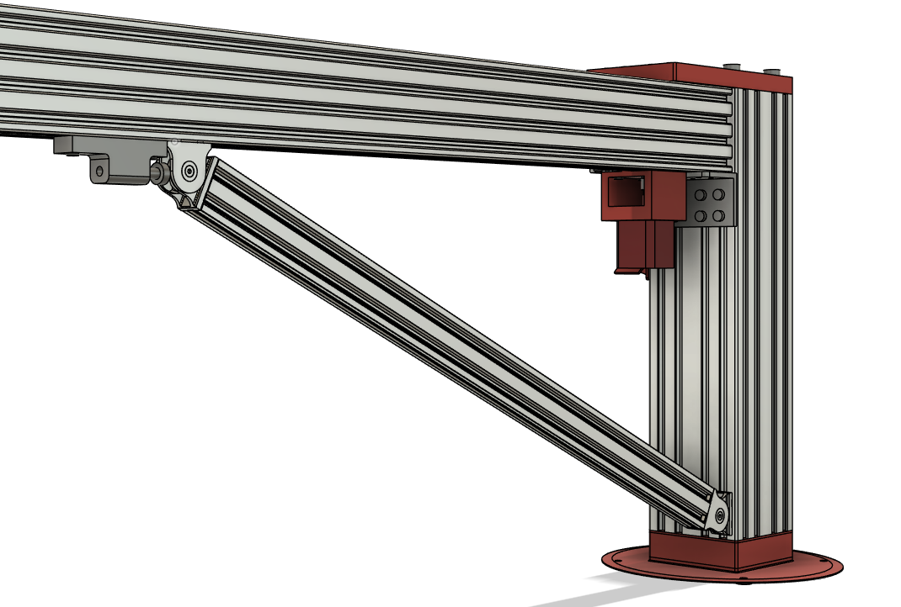

The HUB-Arm-Assy is the second key main component next to the Base. Stiffness is a key criterium

The Hub forms the central stiff part, to which the arm is connected, as well as upper and lower bearing blocks.
The gantry to move the Z-arm in and out of the DUT. 

It is part of this total assembly

The bottom bearing block has a disk shaped part attached to it, that connects with the main pulley of the rotating drive.

The mounting of arm to Hub, is combined with the mount of the Radius movement motor, again to give as much stiffness, also taking into account the 3D printed upper-bearingblock, as it also a key element in the mounting of the arm

A slanted support with a adjustment possibility helps in providing the needed vertical shape stiffness.

The Hub-Arm-assy is made such that, when dismantling the robot for transport or storage, this is a main part.
