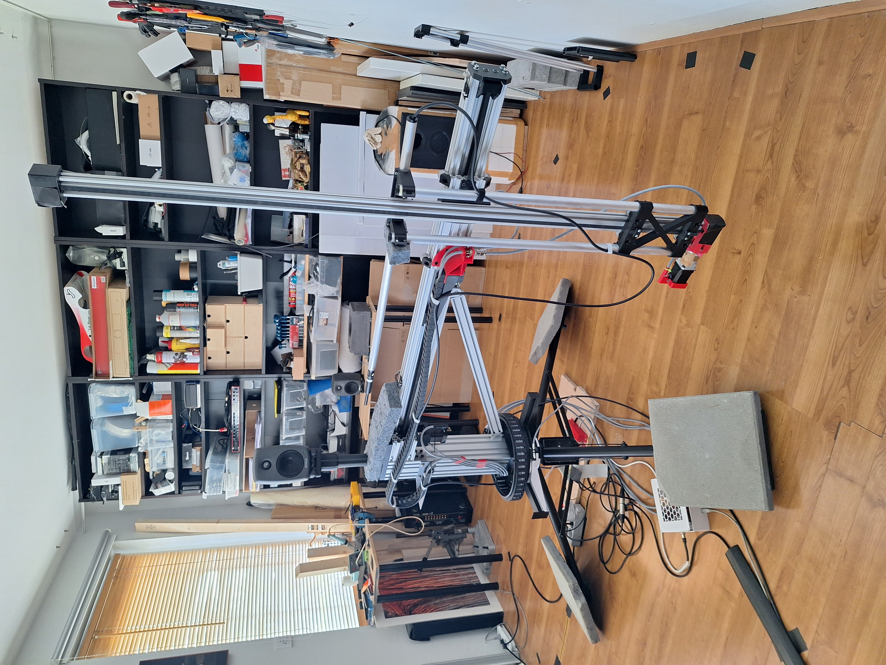

# HALS-Mechatronics design

THE HALS (Holographic Acoustic Loudspeaker Scanner) Mechatronics design process documentation and 3D models Unlike code a physical device cannot be copied. So instead in this repository covers the design, construction, alignment and test process i followed. In this way it provides a path for others to follow and produce their own version of the HALS-Mechatronics.

HALS is composed of 3 main components:

·         Mechatronics design: This repository

·         Measurement s/w    :  [NFS](https://github.com/TomKamphuys/NFS), its GUI [HarmonicDrive](https://github.com/TomKamphuys/HarmonicDrive)

·         Postprocessing s/w  :  [lah-scanner](https://github.com/dfapinov/lah-scanner)

To be completed.

  

## The start

  
The design for me started in July 2025 with a rough sketch depicting a compartimented approach. The reason being that the DIYAUDIO thread "Klippel Near Field Scanner on a Shoestring" sort of came to a silent stand-still despite Tom Kamphuys efforts.

So i contacted Tom to start a collaboration where would do the mechatronics part and he the software part. A bit lateron Dimitri joined with his post-processing software.

Initially i published my approach on the thread in DIYAUDIO with an excel and pictures mostly. Recently we decided to post all on GITHUB. For me this is a learning curve ;-)

To be completed

  

## The breakdown into compartments

My approach started as a sketch, a modular approach so it can be taken apart for movement or storage and fit in a room of 3x5x2.4m . After some desktop research in possible concepts for moving a microphone around a still standing DUT, I decided to base my solution on rotating an arm carrying the movable vertical beam for moving the mic up and down.

To do this in a reasonable period I decided, again after some intense desktop research:

\-          A sturdy steel Tripod as base and central pillar.

\-          Use of V-slot concept profiles and assemblage parts.

\-          Stepper motors & reduction gear.

\-          Internationally available , purchasable parts where possible, like bearings, axle bars, heavy quality tripod, etc.

\-          From the CNC community the grbl based firmware and supported controller and motor driver electronics for the movement controller.

\-          For the linear and rotating movement, a timing belt concept based on HTD3M.

\-          A physical construction that can be taken apart in main modules for movement to different locations or temporarily storage.

\-          Where needed 3D printable parts using PETG, in this case Rapid PETG to reduce printing time.

### The breakdown:

\-          BASE (Foot & Main pillar):

\-          Rotating Drive:

\-          Hub-Arm-assembly:

\-          Z-axis-Mic-Assembly:

\-          Motion (Electronics-Motors):

\-          Cabling:

\-          grblHAL:

\-          To be completed

For each a separate folder is created containing:

\-          Decision list

\-          Pictures

\-          3D step files

\-          Assemby instruction/tutorial

\-          Test tutorial/results

\-          3D print instruction

To be completed
