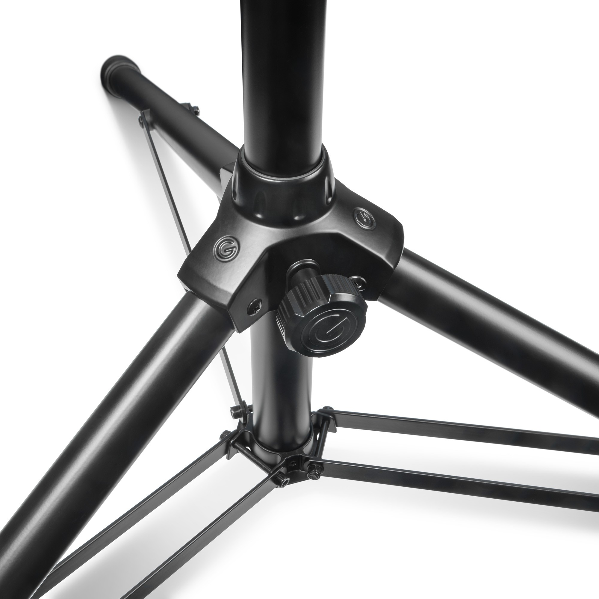
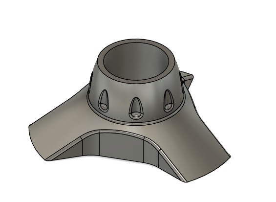
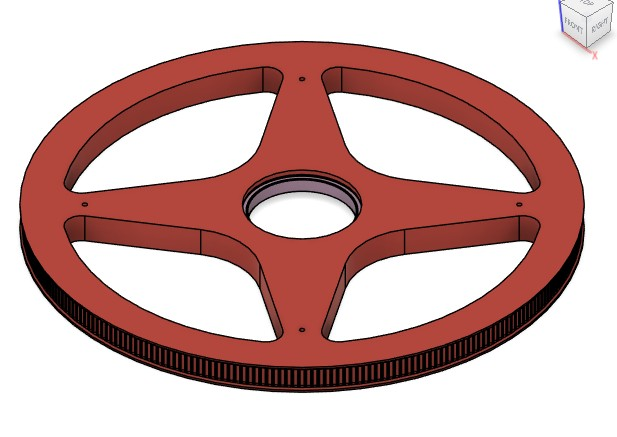

# HALS-Mechatronics: RotatingDrive readme
## The aluminium mounting-bracket as core mounting place
The aluminium mounting-bracket of the Gravity TSP5212LB tripod is the central piece that gives the stiffness of the tripod. Also w.r.t. torsion
  
To use that for holding firmly the rotating drive i first made a 3D copy of that mounting-bracket and used that to substract it from the 3D chassis model-assembly.
 

## The belt transmission
The rotating drive was the most difficult for me to determine the right motor reduction and sizing of belt etc on beforehand. Basically because i had at that time little understanding of the stepper motor behaviour.
So basically i did some off the shelf standard moment of inertia calcs, looked at the force in the belt first and availabiltiy of type of belts, and above all any usefull info regarding sizing given the use case.
Well the use-case can be best described as start-stop with also quite some accuracy. It turned out to be a oulier type of use-case. But sources from Gates and from a byonic knee study of a university i learned that pre-tensioning of the belt is crucial and should be pretty high.
To get positioning accuracy it is better to have enough steps per move, either by a reduction or microstepping. 
And GRBL , lateron grblHAL, does not have a specific function for + / - 180 degrees rotation. Luckily a rotation is a linear (1-dimensional) movement as is a straight line movement, so in GRBL specification where you enter the steps per mm movement, for the rotation that therefore is per 1 degee movement. 
Looking at the force a belt can handle, its availability and given the 3D modeling needed for the main pulley i settled for HTD3M toothed belt.
To test, i built a hub-arm assembly with some wooden beams, and applied several kilos of mass on it. THe Z-axis assembly can be seen as a point load and calcs show it is the most important factor in the inertia. So 3D printed a simple rotating drive concept and tested.
At that time we stil used Arduino for the controller, that is limited in its microstepping.
Still testing showed that with enough reduction a precise start-stop was possible. But also that the forces on the chassis were considerable, thus to prevent too much deformation of chassis the outer-fibre distances and skinn thickness need to be enough to keep the load well in the linear range of the 3D FDM print material , being Rapid PETG from Elegoo. Its creep behaviour is fine.
In the second (revised) proto the reduction of 135:1 (270t-20t plus 10:1 motor reduction) gave the accuracy within 1 degree, and at enough speed  for a 180 degree move (~ 9 seconds).
The belt-tensioning mechnanism has to be in both belt-lengths given the start-stop and the forward-reverse direction of movements.
For the motor pulley one can buy that, but for the main pulley i decided for 270 teeth and with a macro easily modeled in Fusion360. Test prints showed that the quality/accuracy was fine.
The only real issue i had was the calculation of the length of the belt in combination with the centrline distances of motor and main. The calculation on the Dold-Mechatronik.de website was by far the best: https://www.dold-mechatronik.de/Zahnriemen
The way the chassis is mounted on the tripod mount-bracket proved to be a right choice.

## The 3d printed parts forming the Chassis

Shows a video:

## The 3D printed 270t HTD3M pulley

