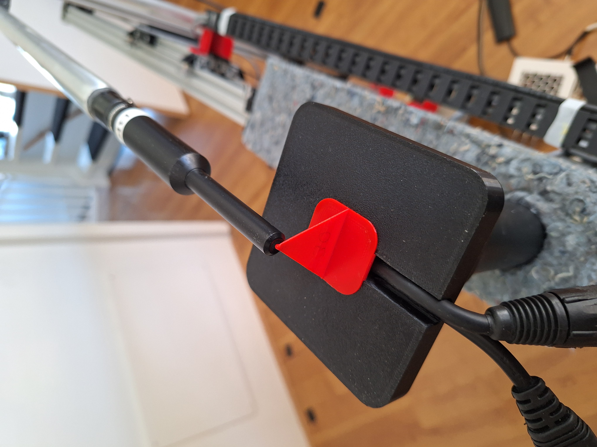

# HALS-Mechatronics: STOOL readme
To place a DUT, a stool is needed. To minimize vibrations etc, the stool needs to fit tightly on the central pillar. For larger DUTS a strap is needed to secure the DUT placement, per suggestion of Mark Krachenko.
As these stools are to be 3D printed, be sure that the printer settings give a very tight fit. For strength I use Rapid PETG.
For the 3D model, a Fusion360 archive file is present for the 3D models of the stools and calibration triangle
The excel holds the decisions I made, and on a separate tab the BOM.
The images give an idea of the 3D models and the stool positioned on the central pillar.

For the calibration triangle two parts need to be printed. And when printed glued while accurately aligned.
This triangle is flexible, thus very microphone friendly, as i experienced also myself ;-)

In the F360 file is also a first attempt to make a placement caliper, especially for small boxes. This is an area where i think some form of supporting tools are needed.
