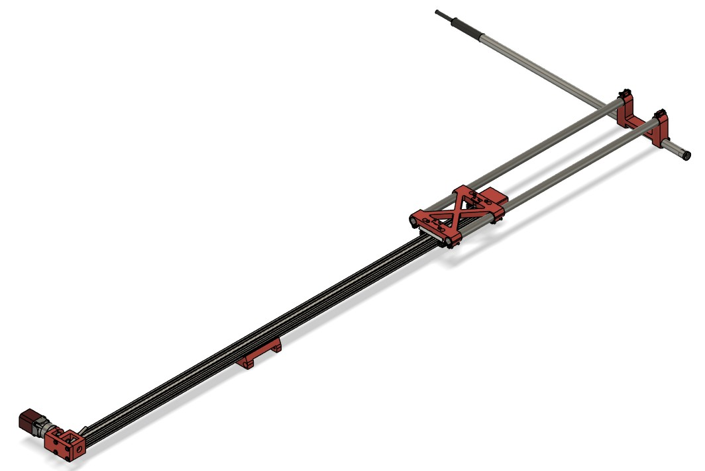
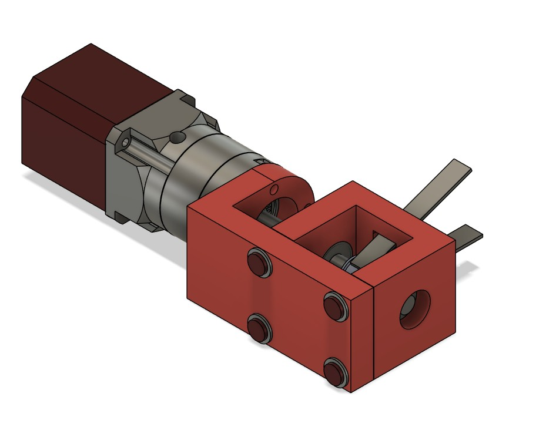
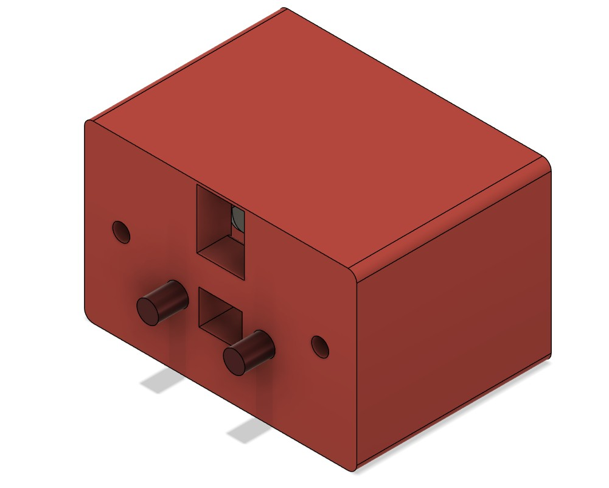
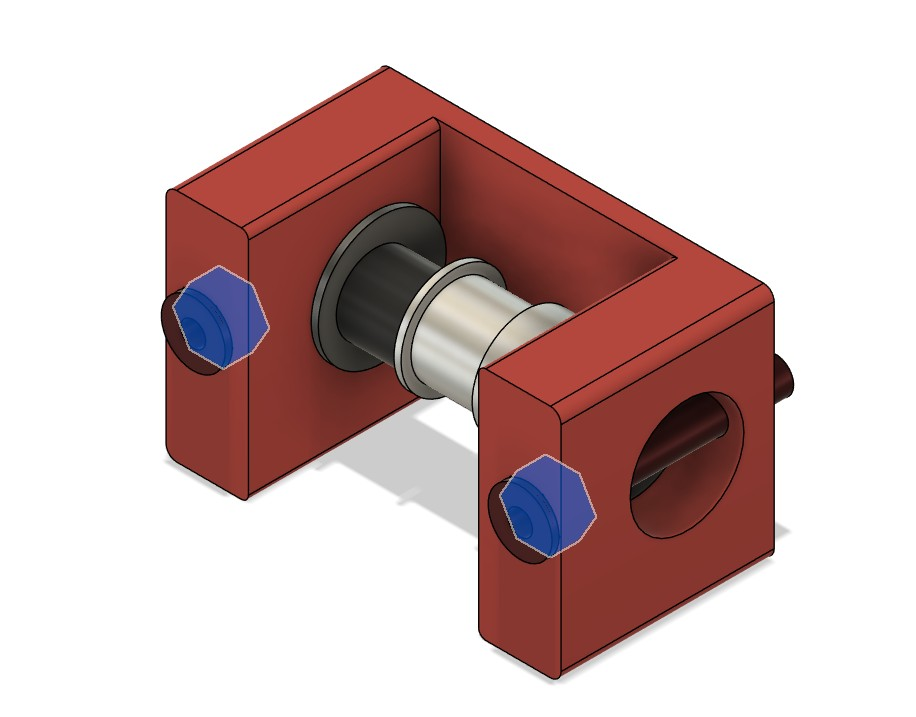
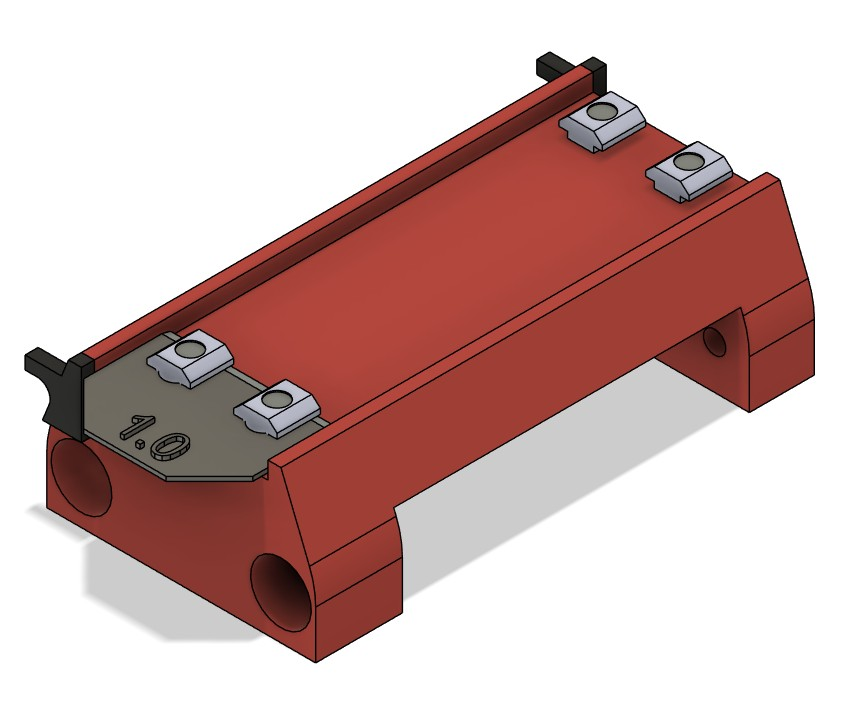
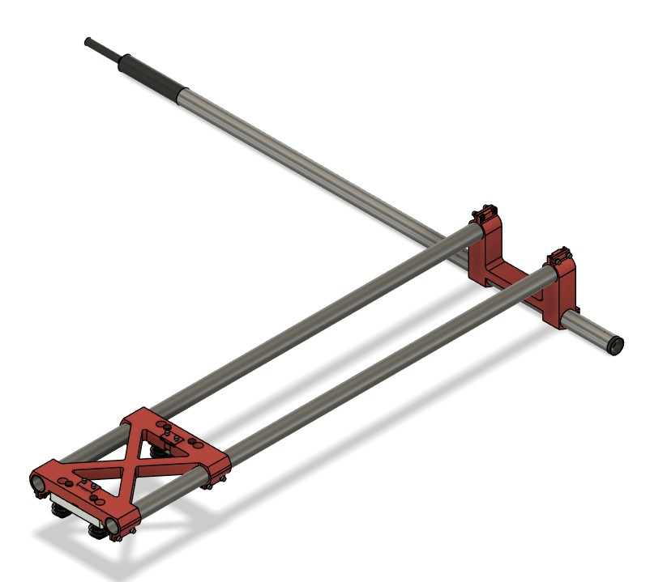

## HALS-Mechatronics: Z-axis-assembly

# The Z-Axis-Assembly
The Z-axis assembly is the complete unit for the Z-movement of the microphone. And is mounted on the gantry of the Arm

The core element is a v-slot20x40 beam of 1400mm long, with M5 threading on both ends. 
The other main parts are the:
Motor-Kant, 

the Spanner-Kant, 
 

The Gantry-Montage 
 

and the X-Gantry-assy

 

The motor and reduction gear are displayed her, but are covered in the Motors section.
For the toothed belt a GT@-9mm open end belt is used, with appropriate toothed pulleys to drive the gantry up and down.

Included in this section is an Excel with my design decisions, and a BoM . Also included is a F-360 file with the whole assembly, and also one in STEP format.

When complete and mounted on the Gantry of the Arm, for the vertical squaring a shim will probably be needed. So shim is one of the 3D printable parts, with the thickness that needs to be defined during squaring. Its thickness is quite sensitive, 0.1mm makes already a difference.

